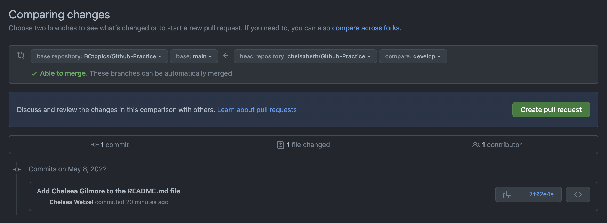
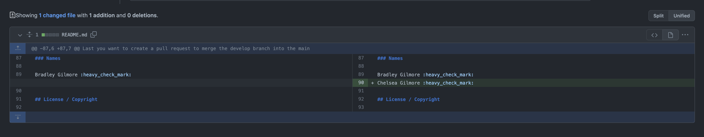
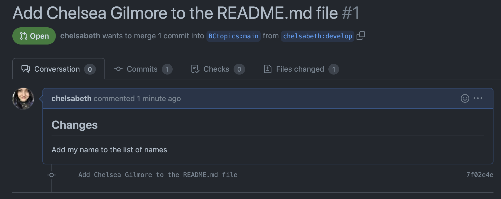

# Github Practice

### Description

This project is built to help walk students through their first Git and Github experience.

After completing this project you will be able to:

* Navigate to a folder/directory using terminal
* Clone a project from Github with Git
* Modify an existing file inside of that repository
* Add, commit, and push those changes to Github using Git
* Create a new branch
* Create a pull request
* Fork a project

## Guide

### Forking this Project

Forking is a way to copy an existing repository to your own profile. This way, you have full modifying capibilities. This will allow you to modify the project and push your own version up to Github.

1. Navigate to the Repository on Github (psst..you're already there).
2. Locate the fork button.
3. Click this button, wait a moment for it to finish. You should then be relocated to your own version of the project. You can tell because it will have ```your username/Github-Practice``` instead of saying ```BCTopics/Github-Practice```.

### Cloning this Project

Cloning a project is similar to downloading a project. By cloning this project from Github using Git you will have access to this project on your local machine.

1. Navigate to YOUR Repository on Github (You're already there).
2. Click on the green code button. Copy this URL to your clipboard using Command and C or hit the handy button to the right of the URL that does it for you.
3. Open up terminal.
4. Navigate to you're intended directory. To navigate to the desktop type cd Desktop/
5. Type: ```git clone [URL GOES HERE]```
6. Now that you have cloned the project down to your machine we need to navigate inside that project. To do this type: ```cd Github-Practice/```
7. To confirm you have done these steps correctly when typing: ```git status``` it should tell you that you are on a specific branch.

### Create a new branch

It's best practice to work off a develop branch, not main.

1. Let's create a new branch called develop. To do this type ```git checkout -b develop```
2. You should now be on your new develop branch. To confirm this type ```git status``` it should mention what branch you are on.

### Connect your new branch to Github

To have this branch exist on Github we will need to do one additional step. We need to connect our local branch ```develop``` to our remote branch on Github called ```develop```(Which doesn't exist yet).

1. In terminal, type: ```git push -u origin develop```

### Modifying the name File

Let's add our name to a README file.

1. Open up the file README.md using a IDE or basic text editor. I would personally use sublime.
2. Go to the very bottom of the file where the section says "names"
3. Add your name to this list, after your name and a space put the following ```:heavy_check_mark:```. This will appear as a checkmark.
4. Save your changes but either manually clicking save or hitting Command and S

### Getting our changes on GitHub

Now that we have our changes saved we need to go through our Git and Github workflow.

1. Go back to terminal. If you closed it previously make sure you navigate back inside the directory with the repository.
2. To add our changes to Git we need to type ```git add .``` Hit return.
3. We need to then commit our changes letting everyone know what we changed. To do this type ```git commit -m "Add [insert your name here] to the README.md file"```
4. Next we need to push these changes up to Github. To do this type ```git push```

### Add me as a contributor

To accept a pull request I will need to be added as a contributor. This allows me to make changes to your repository.

1. Click on the settings tab inside of your Github-Practice repository.
2. Under access it should say Collaborators on the left side. Click on that.
3. Hit the green Add people button. Type my username which is ```BCTopics```
4. Hit the select contributor button.

### Create a pull request

Last you want to create a pull request to merge the develop branch into the main branch. This will add your name to the list name list!

1. Go to the Pull requests tab at the top of **your version** of the Github-Practice repository.
2. Click the green "New pull request" button on the right side of your screen.

    :warning: Detailed insturctions ahead, please feel free to read them twice :warning:

* Once you hit that shiny green "New pull request" button, it will take you to a screen where you can select which branch and repository to merge together. Don't let this intimidate you, I will walk you through step by step!

3. The first on the list is the "base repository" and the "base." These represent the base repository and the base branch that you would like the changes that you just made to effect.

4. The second repository and comparing branch name on the list represents where your changes are coming from (aka the repository that you cloned and your develop branch).

5. From here you will want to...
    * select the base repository as ```BCTopics/Github-Practice``` and the base branch name as ```main```

    * Then select the head repository as ```[your-github-username]/Github-Pactice``` and the compare branch as your ```develop``` branch.


    if you need some guidance, look at this screenshot 👇
    

6. Once you have selected the correct repositories and branches you should be able to see the comparisons between them at the bottom of your screen.
    * it should say "1 file changed" with one side representing the branch and repository you are merging into and the other side representing the branch and repository you made changes on.

    * you should see that you added your name and a check mark to the list of names

    

7. After you have taken a good look at your pull request and have made sure it is implementing everything you intend, click the green button that says "Creat pull request."

8. This should take you to a screen that lets you put details for your pull request. **Don't skip this step!** This is an important resource that Github provides for you to be able to let your team know exactly why you are creating this pull request.
    * We are going to keep the auto-filled title because I feel it is a good indication of exactly what is being done in this pull request. It should say ```Add [your name] to the README.md file```

    * Next we will create a good description for this pull request. This should be describing what you changed and why you changed it. For example we are going to type...##Changes, then hit return, then type "Add my name to the list of names." Formatting your description this way will make your pull request easily readable with a header and text.

    

9. Once you have added a good title and description, push the green button to finish creating you pull request. This should then take you to a page where you can see your open pull request.

🎉 Congratulations! You have just opened your very first pull request, you should be very proud of yourself! Now we just wait for this pull request to be approved and merged into the proper repository 🎉

---
## Names

Bradley Gilmore :heavy_check_mark:
Chelsea Gilmore :heavy_check_mark:

## License / Copyright

© Bradley Gilmore 2022. Unauthorized use and/or duplication of this material without express and written permission from Bradley Gilmore is strictly prohibited.


